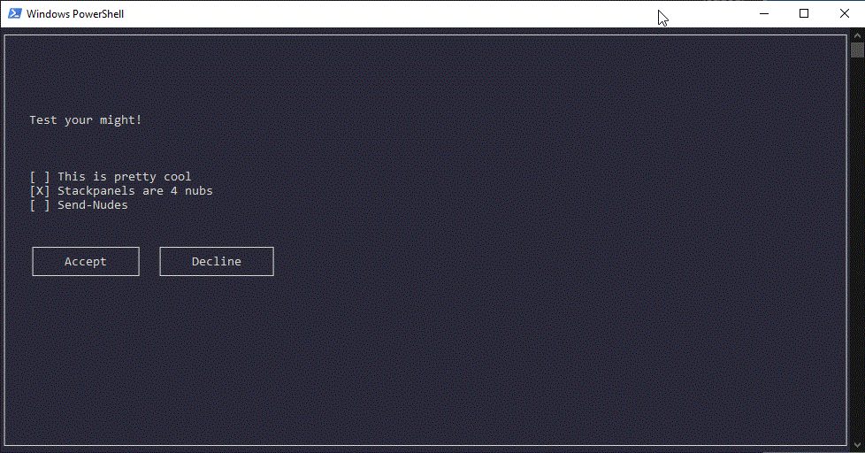

# Clickable Menus for PowerShell

A proof of concept PowerShell module to create very simple but mouse-clickable menus in the PowerShell console.



### Usage

The UI shown in the header GIF was created like this:

```powershell
$form1      = New-UIForm -Name 'Form1' -Border
$button1    = New-UIButton -Text "Accept" -X 4 -QuitsForm
$button2    = New-UIButton -Text "Decline" -X 22 -QuitsForm
$checkboxes = @(
    New-UICheckbox -X 4 -Y 10 -Text "This is pretty cool"
    New-UICheckbox -X 4 -Y 11 -Text "Stackpanels are 4 nubs"
    New-UICheckbox -X 4 -Y 12 -Text "Send-Nudes" -HighlightStyle ColorElement
)
$form1.Add($button1)
$form1.Add($button2)
$form1.Add($checkboxes)
$form1.Add( $(New-UILabel -Text "Test your might!" -X 4 -Y 6) )
$usrButtonPress = $form1.Show()
```

The `.Show()` method of a `[UIForm]` returns the button the form was quit with (Or -1 if the form was quit with the ESCAPE key). Buttons that quit the form
on click need to have `-QuitsForm` specified when they are created. Checkboxes by contrast are manipulated live in memory as the user checks and unchecks them. This means checking a `$checkbox` and aborting with ESCAPE will still leave the `$checkbox.Checked` as `$true`. Forms can only be quit with ESCAPE or a button-press.

This behavior means that the recommended way to parse the users input is:
```powershell
[...]
$usrButtonPress = $form1.Show()

switch ($usrButtonPress.Text) {
    'Accept' {

    }
    'Decline' {

    }
    default {
        # It is important to cover default (or $usrButtonPress -ne -1)
        # because this is what happens when the user quits with ESC
    }
}

# After the form closes, your pre-existing checkbox Variables
# will have been manipulated and can be checked directly:
if ($checkboxes[0].Checked) {
   
} else {

}
```


### Do not use this Module for anything serious!

It calls Win32 APIs without proper error handling, it's a little messy all around and in general - it's "GUIs" in an automation language.
I just created it because I thought one day that this *should work* so I tried it - and it did :)

Because [PowerShell V5 classes are a little troublesome in proper PowerShell Modules](https://stackoverflow.com/questions/31051103/how-to-export-a-class-in-powershell-v5-module)
this script is provided as a single .ps1 file meant to be dot-sourced and not a proper .psm1 Module - for now please import it like this:

```powershell
. .\ClickableMenus.ps1
```

That being said PRs are welcome.
